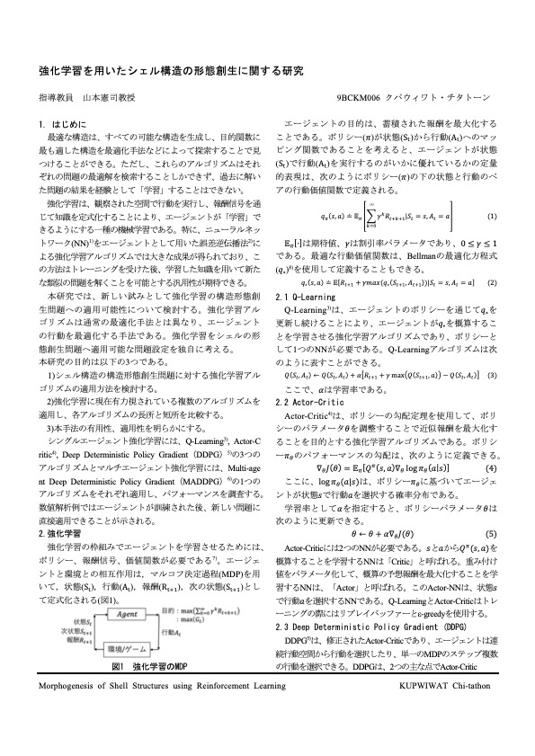
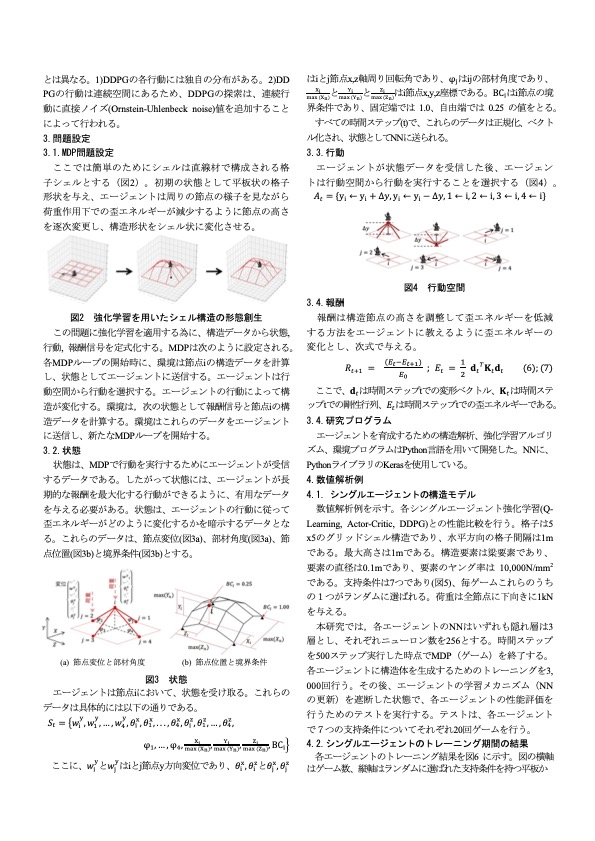
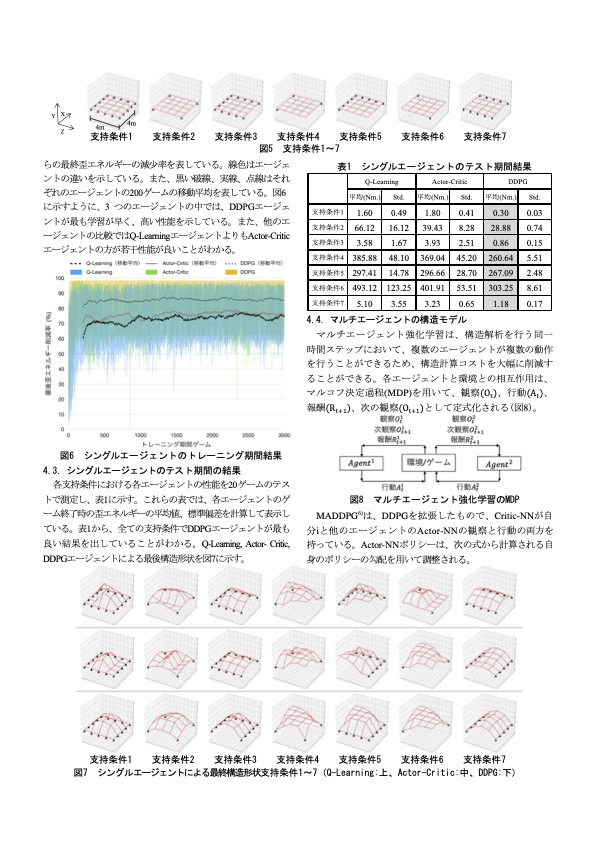
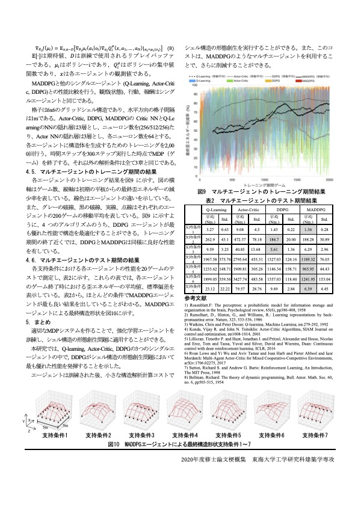

# RL-Structure

 Reinforcement learning for frame structure shape generation using reinforcement learning. 
 These programs are extended part of my master thesis from Graduate School of Engineering, Tokai Univ. Japan 2019-2021. 

 In this research, we train muitiple type of reinforcement learning agents (Q-Learning, Actor-Critic, DDPG, MADDGP) for 

 1. frame structural shape generation to minimize strain energy. 
 2. minimal surface generation to minimize the domain surface area. 

 After some training agents will be able to perform these tasks. 

 I make this program for my juniors to do their research using google-colab. 
https://colab.research.google.com

 please see manual folder for more detail 

 My thesis book and handout PDF files can be obtained at 

 Book :  
 https://www.dropbox.com/s/nrvvgkae2s5n0m8/CKupwiwat_%E8%AB%96%E6%96%87.pdf?dl=0  
 Handout :  
 https://www.dropbox.com/s/ef4nz8xxrdb243e/00_%E5%A4%A7%E5%AD%A6%E9%99%A2%E6%A2%97%E6%A6%82%E9%9B%86%E5%9F%B7%E7%AD%86%E8%A6%81%E9%A0%98_CKupwiwat.pdf?dl=0  
 (Both are in Japanese) 

 Thesis handout 
  
  
  
  

 Contact 
 Personal email: kupc25648@hotmail.com 
 University email: kupwiwat.chitathon.73c@st.kyoto-u.ac.jp 
 Linkedin: https://www.linkedin.com/in/chi-tathon-kupwiwat-72164b105/ 
